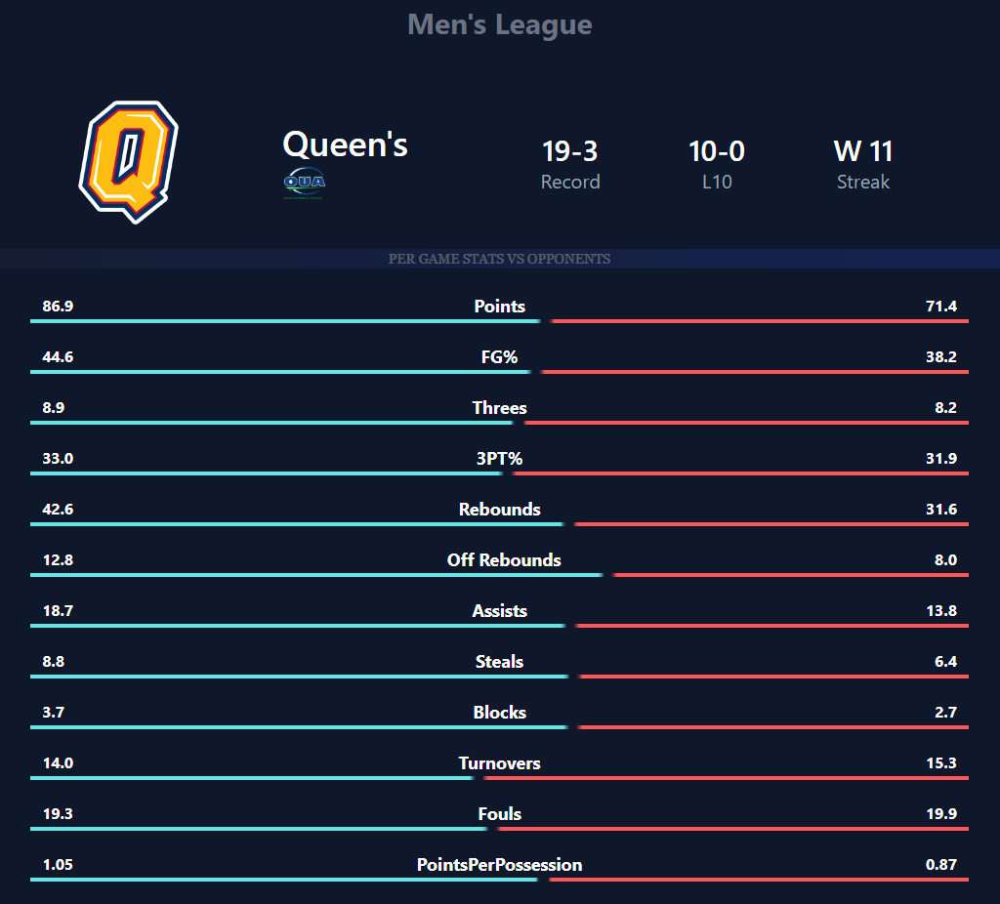
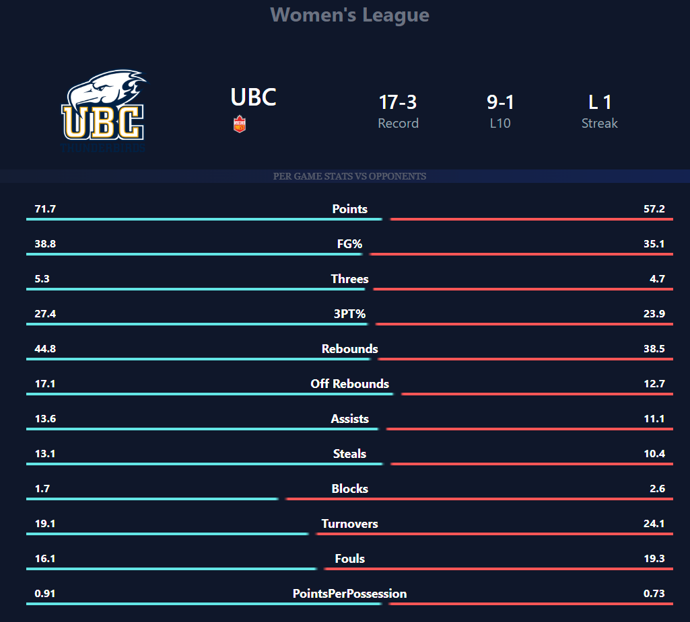
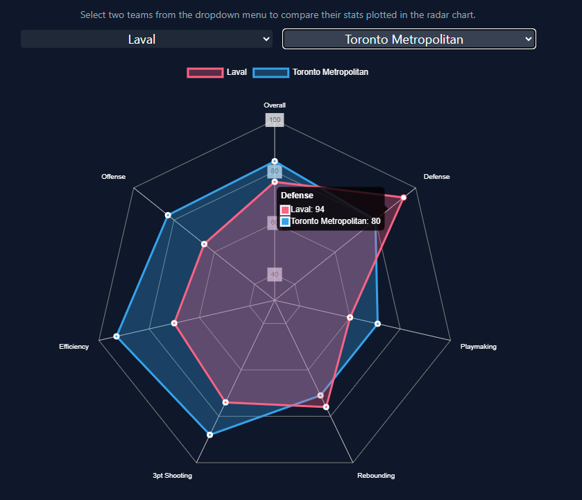
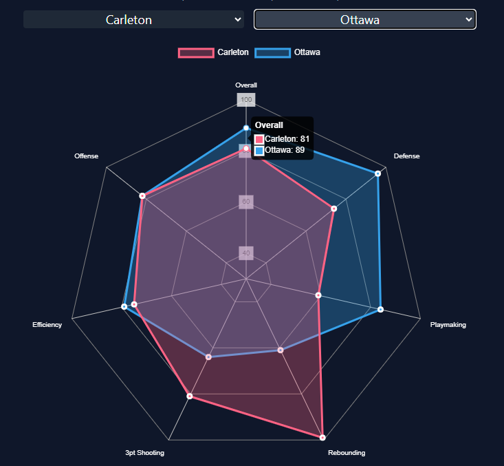
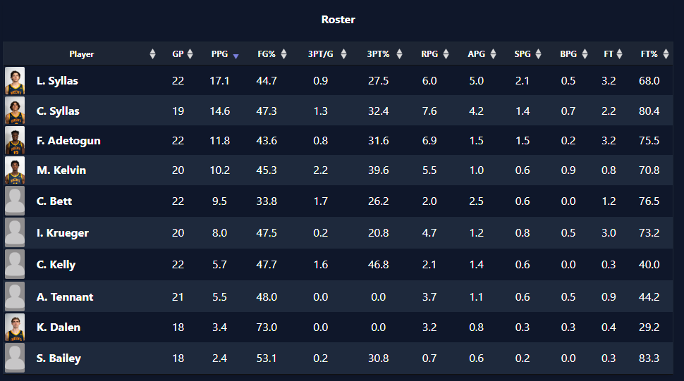
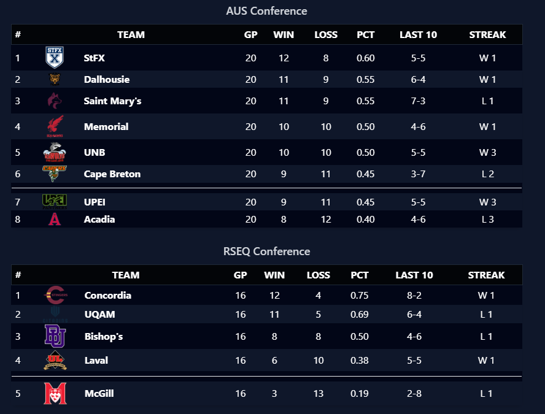

# U SPORTS BASKETBALL WEB APP (IN PROGRESS) 🏀

This website is a platform for sharing analytics and insights into the Canadian university basketball league, or U Sports. I am passionate about basketball and data analysis, and this project allows me to combine the two.

## Goal
I want to provide valuable data-driven insights and analytics to basketball enthusiasts, coaches, players, fans, and prospective professional league stakeholders such as the CEBL so that they can better understand and enjoy U Sports basketball. Through this project, I aim to promote the sport and help it grow in Canadian universities.

## Project Structure

The U SPORTS BASKETBALL WEB APP project is organized into two main folders:

1. **data_pipeline**: This folder contains scripts and functions for updating the database with the latest data from the USports website.

    > Note: [usports-basketball](https://github.com/ojadeyemi/usports-basketball "Python package for current usports basketball stats") has been integrated as a dependency in web application development. This allows for independent script maintenance and updates while ensuring seamless integration with the application's data processing pipelines. 

2. **usport_flask_app**: This folder contains the Flask application code. It includes the routes, models, and other web application files.

---

### **Screenshots**

    
    

    
    

     
    

## Contributing

This web application is open source, and contributions are encouraged! To contribute, fork the repository, make changes, and then submit a pull request. I appreciate your contributions, whether bug fixes, new features, or documentation improvements.

Please look at the [`CONTRIBUTING.md`](CONTRIBUTING.md) file for contribution guidelines.

## Contact

For any questions, feedback, or inquiries, feel free to contact me:

- LinkedIn: [OJ Adeyemi](https://www.linkedin.com/in/oj-adeyemi/)
- Email: ojieadeyemi@gmail.com

(<a href="#readme-top">back to top</a>)

<!-- LICENSE -->

## License

Distributed under the MIT License. See [`LICENSE`](LICENSE) for more information.
